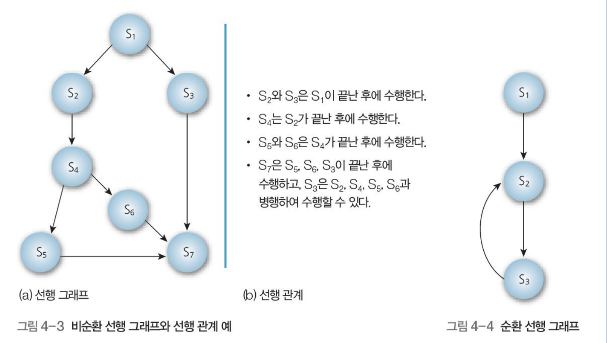
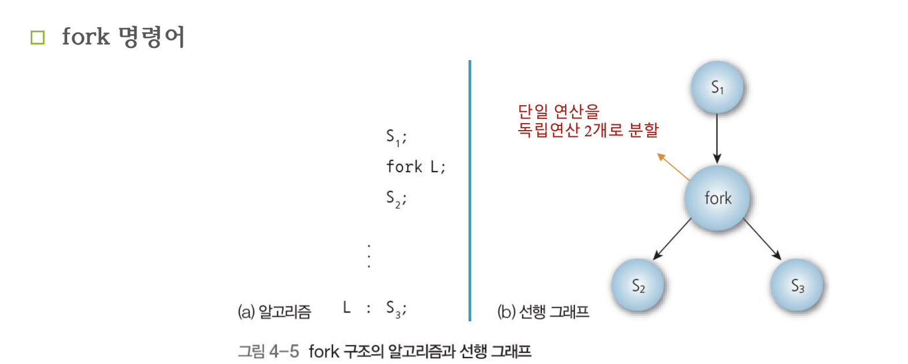
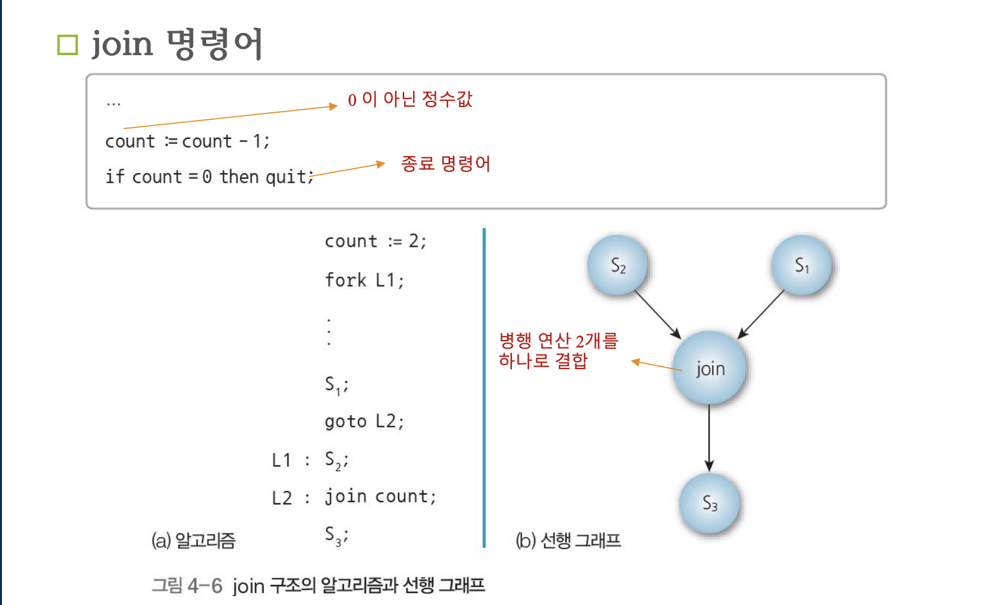
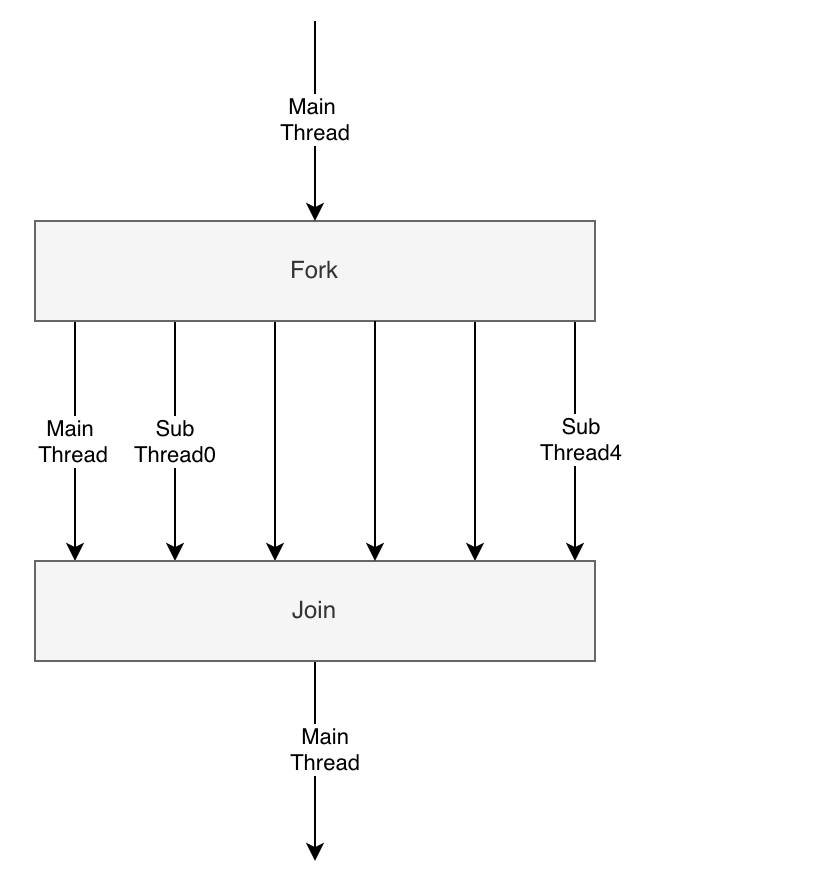
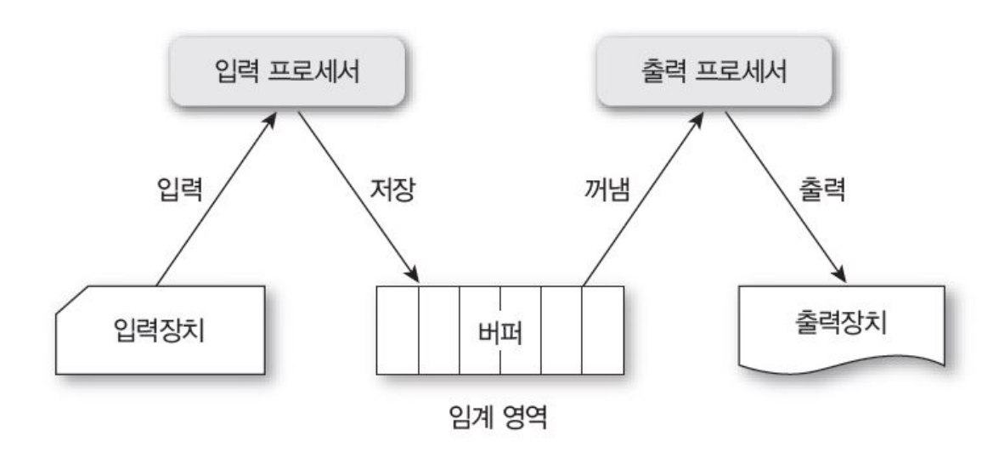
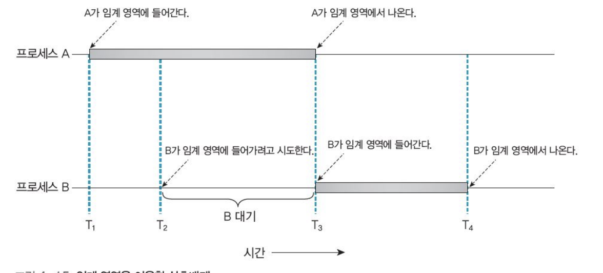
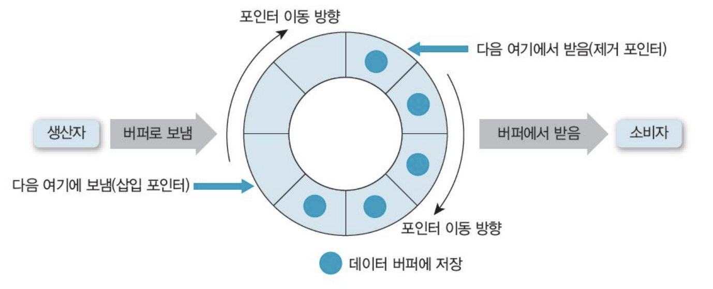
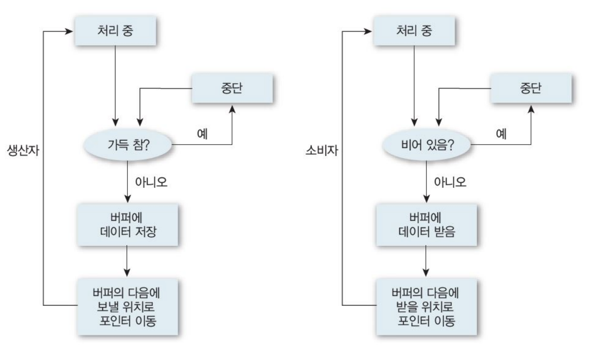
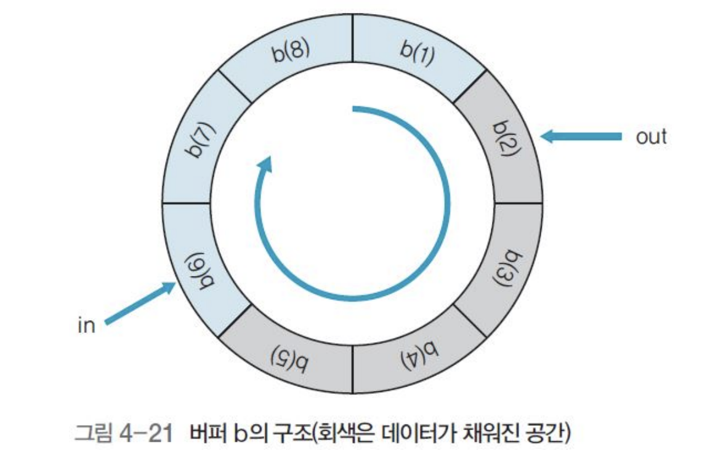

# 상호 배제와 병행성

## 1. 병행 프로세스의 개념

- 병행 프로세스 개념
    - 운영체제가 프로세서를 빠르게 전환
    - 프로세서 시간을 나눠 마치 프로세스 여러개를 동시에 실행하는 것 처럼 보이게 하는 것

- 병행 프로세스 종류
    - 독립 프로세스
        - 단일 처리 시스템에서 수행하는 병행 프로세스, 다른 프로세스에 영향 주고 받지 않으면서 독립 실행
        - 다른 프로세스, 데이터와 상태 공유 않고 동작도 재현 가능
        - 주어진 초기값에 따라 항상 동일한 결과
        - 중지 후 변동 없이 다시 시작 가능
        - 독립 실행 할 수 있는 프로세스
            - 단일 프로그래밍 : 프로세서를 사용 중이던 프로세스 완료 후 다른 프로세스 실행
            - 다중 프로그래밍 : 프로세스 여러 개가 프로세서 하나 공유, 공유하지 않는 상태 일 때 디스패치 순서 상관 없음
            - 다중 처리 : 프로세서 2개 이상 사용하여 동시에 프로그램 여러 개를 병렬 실행 프로세스는 한 번에 프로세서 하나에서 실행하지만, 동일한 시스템에서는 서로 다른 시간에 서로 다른 프로세서에서 실행 가능
    - 협력 프로세스 
        - 다른 프로세스와 상호작용하며 특정 기능 수행하는 비동기적 프로세스
        - 제한된 컴퓨터 자원의 효율성 증대, 계산 속도 향상, 모듈적 구성 강화, 개별 사용자의 여러 작업 동시에 수행 편의성 제공에 사용
        - 간단한 예 : 두 프로세스의 동일한 파일 사용시
        - 프로세스 하나가 파일에서 읽기 수행 동안 다른 프로세스가 해당 파일에 쓰기 수행하며 서로 영향
        - 병행 프로세스들이 입출력 장치, 메모리, 프로세서, 클럭 등 자원을 서로 사용시 충돌 발생
        - 충돌을 피하기 위한 프로세스의 상호작용 형태 
            1. 프로세스는 서로 인식하지 못하는 경쟁 관계 유지. 다중 프로그래밍 환경이 대표적인 예로, 운영체제가 자원 경쟁 고려하여 동일한 디스크나 프린터로 접근 조절
            2. 프로세스는 입출력 버스를 비롯한 개체를 공유하는 단계에서 간접적으로 서로 관계 인식. 이 때 다른 프로세스에서 얻은 정보에 의존, 프로세스의 타이밍에 영향. 프로세스들은 개체 공유에 따른 협력 필요
            3. 프로세스에는 서로 인식하고 프로세스끼리 통신할수있는 기본 함수 있음. 프로세스가 서로 협력관계에 있으면 직접 통신 가능, 병행해서 함께 동작 가능

## 2. 병행 프로세스의 해결 과제

- 병행성
    - 여러 프로세스를 이용하여 작업을 수행하는 것
    - 시스템 신뢰도 높이고 처리 속도 개선, 처리 능력 높이는 데 중요

- 병행 프로세스의 문제 
    - 공유 자원 상호 베타적 사용 (프린터, 통신망 등은 한 순간에 프로세스 하나만 사용)
    - 병행 프로세스 간의 협력이나 동기화
    - 두 프로세스 간 데이터 교환을 위한 통신
    - 동시에 수행하는 다른 프로세스의 실행 속도와 관계 없이 항상 일정한 실행 결과 보장(결정성 확보)
    - 교착 상태 해결, 병행 프로세스들의 병렬 처리 능력 극대화
    - 실행 검증 문제 해결
    - 병행 프로세스 수행 과정에서 발생하는 상호배제 보장

## 선형 그래프와 병행 프로그램

- 선행 그래프 (precedence graph)
    - 선행 제약의 논리적 표현
    - 프로세스 : 프로세스 집합과 이것의 선행 제약, 두가지 요소로 정의
    - 선행 제약 : 프로세스를 순서대로 다른 상태로 옮기는 것
        - 두 프로세스에 선행 제약이 없으면 이 둘은 독립적이므로 병행 실행 가능
    - 순차적 활동을 표현하는 방향성 비순환 그래프
    - 선행 그래프에서 노드는 소프트웨어 작업이거나 동시에 실행 할 수 있는 프로그램 명령

```python3

a = x + y # -> S1 S1과 S2는 동시 실행 가능
b = z + 1 # -> S2
c = a - b # -> S3 a, b 값이 할당 되기 전 수행 불가
w = c + 1 # -> S4 c 값 계산 전 수행 불가
```

 

*비순환 선행 그래프와 선행 관계 예시*

- fork 와 join 구조
    - 선행 그래프는 연산의 선행 제약 정의에 유용하지만, 2차원이라 프로그램에는 사용 곤란
    - 선행 관계 명시 위해 fork와 join 구조, 병향 문장(parbegin, parend) 등 다른 방법 필요



*fork 구조의 알고리즘과 선행 그래프*




*join 구조의 알고리즘과 선행 그래프*

```text

간단한 산술 알고리즘

a := x + y;
b := z + 1;
c := a - b;
w := c + 1;

parbegin/parend 구조 알고리즘 
병행 처리 가능한건 하고, join 해서 한번에 처리

parbegin
    a := x + y;
    b := z + 1;
parend;
    c := a - b;
    w := c + 1;
```


```python3

from multiprocessing import Process, Queue

def work(id, start, end, result):
    total = 0
    for i in range(start, end):
        total += i
    result.put(total)
    return

if __name__ == "__main__":
    START, END = 0, 100000000
    result = Queue()
    th1 = Process(target=work, args=(1, START, END//2, result))
    th2 = Process(target=work, args=(2, END//2, END, result))
    
    th1.start()
    th2.start()
    th1.join()
    th2.join()

    result.put('STOP')
    total = 0
    while True:
        tmp = result.get()
        if tmp == 'STOP':
            break
        else:
            total += tmp
    print(f"Result: {total}")

```

*파이썬에서의 병렬처리 예*

위 멀티프로세싱 코드에서 보면. 

Queue 객체를 이용했는데, 이는 각각의 프로세스가 자신만의 메모리 공간을 사용 했기 때문에 프로세스간 데이터 교환을 위해 multiprocessing.Queue 객체를 이용해 데이터 교환을 한 것 .

```python3

th1.start()
th2.start()
th1.join()
th2.join()
```

join 을 사용한 이유는 메인 스레드 (메인 코드 블럭)가 th1, th2 각각의 프로세스가 작업을 종료 한 이후에 result.put('STOP') 과 같은 뒤에 오는 코드를 처리하도록 하기 위해서 계산하는 프로세스 끝날 때 까지 기다리라는 의미 !!!!!!

파이썬에서의 멀티 스레드와 멀티 프로세스의 차이라고 한다면 !!

멀티 스레딩은 가볍지만, GIL로 인해 계산하는 작업은 오직 하나의 스레드에서만 작업하기 때문에 여러 데이터를 동시에 계산하고, 단일 변수에 저장하고자 할 때는 불리하다. 다만 메모리를 각자 나누는게 아니기 때문에 메모리 이점은 있다.

멀티 프로세스는 프로세스 각자 고유한 메모리 영역을 할당받게 되기 때문에 메모리 측면에서는 불리하지만, 계산하는 작업을 빠르게 할 수 있다 !!

```python3
from multiprocessing import Process
import os

def info(title):
    print(title)
    print('module name:', __name__)
    print('parent process:', os.getppid())
    print('process id:', os.getpid())

def f(name):
    info('function f')
    print('hello', name)

if __name__ == '__main__':
    info('main line')
    p = Process(target=f, args=('bob',))
    p.start()
    p.join()
```

개별 프로세스의 ID를 보기 위해서 os 모듈을 import하고, getpid 호출 함.

- 파이썬 멀티프로세싱 모듈에서의 프로세스간 객체 교환

* 큐 

```python3
from multiprocessing import Process, Queue

def f(q):
    q.put([42, None, 'hello'])

if __name__ == '__main__':
    q = Queue()
    p = Process(target=f, args=(q,))
    p.start()
    print(q.get())    # prints "[42, None, 'hello']"
    p.join()
```

큐는 스레드와 프로세스에서 안전하다 !

* 파이프

```python3
from multiprocessing import Process, Pipe

def f(conn):
    conn.send([42, None, 'hello'])
    conn.close()

if __name__ == '__main__':
    parent_conn, child_conn = Pipe()
    p = Process(target=f, args=(child_conn,))
    p.start()
    print(parent_conn.recv())   # prints "[42, None, 'hello']"
    p.join()
```
Pipe() 가 반환하는 두개의 연결 객체는 파이프의 두 끝을 나타낸다.

- 프로세스 간 동기화
    - 멀티 프로세싱과 스레드 모두 한 번에 하나의 프로세스만 표준 출력을 인쇄하도록 Lock을 사용 할 수 있다 !

```python3

from multiprocessing import Process, Lock

def f(l, i):
    l.acquire()
    try:
        print('hello world', i)
    finally:
        l.release()

if __name__ == '__main__':
    lock = Lock()

    for num in range(10):
        Process(target=f, args=(lock, num)).start()

```

Lock을 사용하지 않으면 다른 프로세스의 출력이 모두 섞일 수도 있다.

* 프로세스간 상태 공유
    - 동시성 프로그래밍을 할 때 가능한 공유된 상태를 사용하지 않는 것이 최선이라고 함. 인터페이스는 존재

* 공유 메모리

```python3

from multiprocessing import Process, Value, Array

def f(n, a):
    n.value = 3.1415927
    for i in range(len(a)):
        a[i] = -a[i]

if __name__ == '__main__':
    num = Value('d', 0.0)
    arr = Array('i', range(10))

    p = Process(target=f, args=(num, arr))
    p.start()
    p.join()

    print(num.value)
    print(arr[:])
```


*더 간단한 예제 ㅠㅠ*

```python3

import threading
import time


class Worker(threading.Thread):
    def __init__(self, name):
        super().__init__()
        self.name = name            # thread 이름 지정

    def run(self):
        print("sub thread start ", threading.currentThread().getName())
        time.sleep(3)
        print("sub thread end ", threading.currentThread().getName())


print("main thread start")
for i in range(5):
    name = "thread {}".format(i)
    t = Worker(name)                # sub thread 생성
    t.start()                       # sub thread의 run 메서드를 호출

print("main thread end")

```

메인 스레드가 5개의 서브 스레드를 생성하고, start 메서드를 호출하여 Worker 클래스에서 정의한 run 메서드를 호출한다. 메인 스레드와 5 개의 서브 스레드는 운영체제의 스케줄러에 의해 스케줄링 되면서 실행 된다. 가장 먼저 메인 스레드가 끝나면서 main thread end를 출력한다.

위 코드의 출력

```console
(base)  ~/Desktop/ingkle/2020-kpu-fall-embeded-system/Day4   master  python3 mul.py                                                                               
main thread start
sub thread start  thread 0
sub thread start  thread 1
sub thread start  thread 2
sub thread start  thread 3
sub thread start  thread 4
main thread end
sub thread end  thread 0
sub thread end  thread 2
sub thread end  thread 4
sub thread end  thread 1
sub thread end  thread 3
```

만약 t.start() 밑에 t.join() 을 넣는다면 ? (해당 스레드가 종료되어야 메인스레드를 또 실행하는 함수니까, 각 스레드가 죽으면 넘어가고, 죽으면 넘어가고 하겠다)

```python3

import threading
import time


class Worker(threading.Thread):
    def __init__(self, name):
        super().__init__()
        self.name = name            # thread 이름 지정

    def run(self):
        print("sub thread start ", threading.currentThread().getName())
        time.sleep(3)
        print("sub thread end ", threading.currentThread().getName())


print("main thread start")
for i in range(5):
    name = "thread {}".format(i)
    t = Worker(name)                # sub thread 생성
    t.start()                       # sub thread의 run 메서드를 호출
    t.join() #각 스레드가 완료 될 때 까지 기다림

print("main thread end")

```


```console
(base)  ~/Desktop/ingkle/2020-kpu-fall-embeded-system/Day4   master  python3 mul.py
main thread start
sub thread start  thread 0
sub thread end  thread 0
sub thread start  thread 1
sub thread end  thread 1
sub thread start  thread 2
sub thread end  thread 2
sub thread start  thread 3
sub thread end  thread 3
sub thread start  thread 4
sub thread end  thread 4
main thread end
```

예상한 결과랑 동일하당!!!!



* Fork 랑 Join

지금 봅면 메인 스레드가 서브 스레드를 생성 하는걸 fork라고 한다.
그림처럼 2개의 서브 스레드를 생성한다면 총 3개의 스레드가 스케줄링 됩니다.  

join은 모든 스레드가 작업을 마칠 때 까지 기다리는 것인데, 보통 데이터를 여러 스레드가 병렬로 처리 하고, 그 값을 다시 모아서 순차적으로 처리 해야할 필요가 있을때 사용한다구 핝다 !!!!

## 1. 상호배제의 개념
- 상호배제의 개념
    - 병행 프로세스에서 프로세스 하나가 공유 자원 사용 시 다른 프로세스들이 동일한 일을 할 수 없도록 하는 방법
    - 읽기 연산은 공유 데이터에 동시에 접근해도 문제 발생 않음
    - 동기화 : 변수나 파일은 프로세스 별로 하나씩 차례로 읽거나 쓰도록 해야 하는데, 공유 자원을 동시에 사용하지 못하게 실행을 제어하는 방법 뜻함
        - 동기화는 순차적으로 재사용 가능한 자원을 공유하려고 상호작용 하는 프로세스 사이에서 나타남
        - 동기화로 상호배제 보장할 수 있지만, 이 과정에서 교착 상태와 기아 상태가 발생 할 수 있다 !
    
* 상호 배제의 구체적인 예

    프로세스 P1과 P2가 있다고 치자. 임계자원 - 두 프로세스가 동시에 사용 할 수 없는 공유 자원 - 에 P1이 임계 영역에 진입하면 (임계 영역은 임계 자원에 접근하고 실행하는 프로그램 코드 부분) P2는 임계 자원에 접근 할 수 없다 ~!!!

- 상호 배제의 조건
    1. 두 프로세스는 동시에 공유 자원에 진입 불가
    2. 프로세스의 속도나 프로세서 수에 영향 받지 않음
    3. 공유 자원을 사용하는 프로세스만 다른 프로세스 차단 가능
    4. 프로세스가 공유 자원을 사용하려고 너무 오래 기다려서는 안 됨

## 2. 임계 영역(Critical Section)
- 임계 영역의 개념
    - 다수의 프로세스 접근 가능하지만, 어느 한 순간에는 프로세스 하나만 사용 가능

*임계 영역의 예*



- 임계 영역 이용한 상호배제
    - 간편하게 상호배제 구현 가능 (자물쇠와 열쇠 관계)
        -  프로세스가 진입하지 못하는 임계 영역
    - 어떤 프로세스가 열쇠를 사용 할 수 있는지 확인하려고 검사 하는 동작과, 다른 프로세스 사용 금지하는 동작으로 분류

*임계 영역을 이용한 상호 배제의 예*



- 임계 영역의 조건
    1. 상호 배제 : 어떤 프로세스가 임계 영역에서 작업 중, 다른 프로세스 임계 영역 진입 불가
    2. 진행 : 임계 영역에 프로세스가 없는 상태에서 어떤 프로세스가 들어갈지 결정
    3. 한정 대기 : 다른 프로세스가 임계 영역을 무한정 기다리는 상황 방지 위해 임계 영역에 한 번 들어갔던 프로세스는 다음 임계 영역에 다시 들어갈 때 제한

## 3. 생산자 - 소비자 문제와 상호배제를 해결하는 초기의 시도

- 생산자-소비자 문제
    - 운영체제에서 비동기적으로 수행하는 모델
    - 생산자 프로세스가 생산한 정보를 소비자 프로세스가 소비하는 형태

예시 : 라인 프린터 드라이버 - (생산) -> 문자 - (소비) -> 라인 프린터

컴파일러 - (생산) -> 어셈블리 코드 - (소비) -> 어셈블러

- 생산자의 소비자에게 데이터 전송
    - 소비자가 데이터를 받을 준비를 마칠 때 까지 생산자는 버퍼로 데이터 전송


*공유 버퍼를 이용한 데이터 전송과 수신*



- 생산자와 소비자의 공유 버퍼
    - 생산자는 버퍼가 꽉 차면 더 이상 생산 불가, 소비자는 버퍼가 비면 소비 불가

* 이러한 문제점을 해결하기 위한 시도 중 무한 버퍼
- 무한 버퍼
    - 생산자와 소비자가 독립적으로 알고리즘 수핸



* 해결하기 위한 시도 중 유한 버퍼
    - 논리적 포인터 in과 out 2개로 버퍼 순환 배열



- 버퍼 구조 프로그램 구현

```C
#define BUFFER_SIZE 10
//버퍼 사이즈 정의를 위한 매직 넘버 define

typedef struct{ // 구조체 선언
    DATA data; // 자료형은 DATA 인 멤버이름 data 선언
} item; // 상기 구조체 변수를 바로 선언
item buffer[BUFFER_SIZE];
int in = 0;
int out = 0;
int counter = 0;
```

- 여기서 잠깐, C언어 구조체 공부 !!

```C
struct Person {
    char name[20];
    int age;
    char address[100];
};

int main() {
    struct Person p1;
    strcpy(p1.name, "kim");
    p1.age = 30;
    strcpy(p1.address, "Seoul");

    return 0;
}
```

```C

struct 구조체이름 {
    자료형 멤버이름;
} 변수;

```

위와 같이 바로 변수를 선언 가능하다.

- 생산자 프로세스는 생산하는 새로운 원소를 지역변수 nextProduced에 저장, 소비자 프로세스는 소비하는 원소를 지역 변수 nextConsumed에 저장 각 프로세스 구현

```C
//생산자 프로세스

item nextProduced;

while(true) {
    //버퍼가 가득 차 아무 일도 하지 않음
    while (counter == BUFFER_SIZE);
    buffer[in] = nextProduced;
    in = (in + 1) % BUFFER_SIZE;
    counter++;
}
```

```C
//소비자 프로세스
item nextConsumed;

while (true) {
    while (counter == 0);
    nextConsumed = buffer[out];
    out = (out + 1) % BUFFER_SIZE;
    counter--;
}


- 경쟁 상태 race condition
    - 경쟁 상태의 개념
        - 여러 프로세스가 동시에 공유 데이터 접근 시, 접근 순서에 따라 실행 결과 달라지는 상황 말함
        - 공유데이터에 마지막으로 남는 데이터의 결과 보장할 수 없는 상황
        - 장치나 시스템이 둘 이상의 연산 동시 실행 시, 어느 프로세스를 마지막으로 수행한 후 결과를 저장했느냐에 따라 오류가 발생하므로 적절한 순서에 따라 수행 해야 함
        - 읽기와 쓰기 명령을 거의 동시에 실행해야 한다면, 기본적으로 읽기 명령을 먼저 수행 한 후 쓰기 명령 수행하는 접근
    - 경쟁 상태의 예방
        - 병행 프로세스들을 동기화 해야 함(임계 영역 이용한 상호 배제로 구현)
        - 즉, 공유변수 counter를 한 순간에 프로세스 하나만 조작 할 수 있도록 해야하는 임계 영역과 counter연산 하는 부분을 임계 영역으로 설정하여 상호배제 하는 방법으로 해결

|수준|방법|종류|
|---|---|---|
|고급|소프트웨어로 해결| 데커의 알고리즘, 크누스의 알고리즘, 램포트의 베이커리 알고리즘, 핸슨의 알고리즘, 다익스트라의 알고리즘|
||소프트웨어가 제공: 프로그래밍 언어와 운영체제 수준에서|세마포, 모니터|
|저급|하드웨어로 해결|TestAndSet(TAS)테스|

## 1. 데커의 알고리즘
- 데커의 알고라즘 개념
    - 두 프로세스가 서로 통신하려고 공유 메모리를 사용하여 충돌 없이 단일 자원을 공유할 수 있도록 허용하는 것
    - 병행 프로그래밍 상호배제 문제의 첫 번째 해결책
    - 각 프로세스 플래그 설정 가능, 다른 프로세스 확인 후 플래그 재설정 가능
    - 프로세스가 임계 영역에 진입하고 싶으면 플래그 설정하고 대기

```C

//프로세스가 공유하는 데이터 flag[] : 불 배열, turn : 정수
flag[0] = false;
flag[1] = false;
turn = 0;

// 프로세스 P0
flag[0] = true; // P0 의 임계 영역 진입 표시
while (flag[1] ==true) { //P1의 임계영역 진입 여부 확인
    if (turn == 1) { //P1이 진입 할 차례가 되면
        flag[0] = false; // 플래그를 재설정 하여 P1에 진입 순서 양보
        while (turn == 1) { //turn을 바꿀 때 까지 대기
            // 바쁜 대기
        }
        flag[0] = true; //P1이 임계 영역에 재진입 시도
    } 
}

/* 임계 영역 */
turn = 1; // P1에 진입 순서 제공
flag[0] = false; // P0의 임계 영역 사용 완료 지정
/* 나머지 영역 */ P0이 나머지 영역 수행

// 프로세스 P1
flag[1] = true;
while (flag[0] == true) {
    if (turn == 0) {
        flag[1] = false;
        while(turn == 0){
        //바쁜 대기
        }
        flag[1] = true;
    }
}

/* 임계 영역 */
turn = 0;
flag[1] = false;
/* 나머지영역 */;
```

- 데커의 알고리즘 특징
    - 특별한 하드웨어 명령문 필요 없음
    - 임계 영역 바깥에서 수행 중인 프로세스가 다른 프로세스들이 임계 영역 진입 막지 않음
    - 임계 영역에 들어가기를 원하는 프로세서 무한정 기다리게 하지 않음

* 기타 유용한 상호 배제 알고리즘
    - 다익스트라
    - 크누스
    - 램포트
    - 핸슨
....개많네....

## TestAndSet(테스)TAS 명령어
- 테스형은 내일 공부할예정
