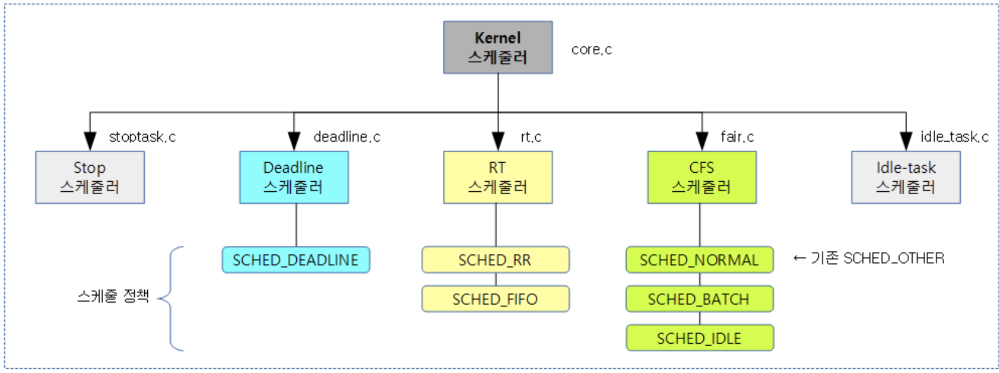
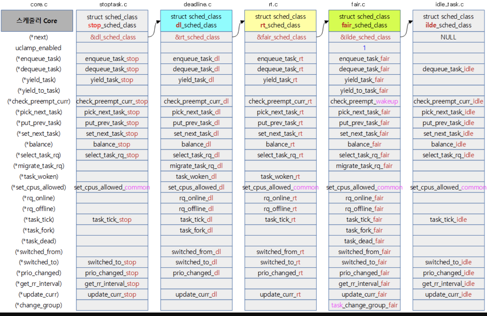
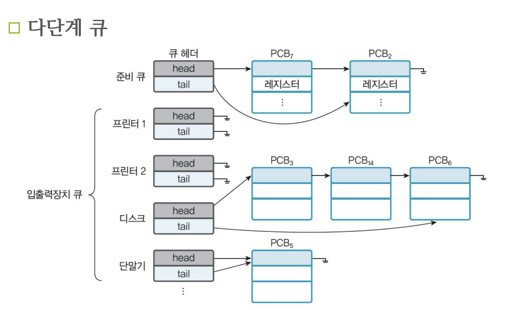

# 1. 스케줄링의 이해

- 스케줄링의 개념
    - 여러 프로세스가 번갈아 사용하는 자원을 어떤 시점에 어떤 프로세스에 할당할지 결정
    - 자원이 프로세서인 경우를 프로세서 스케줄링, 대부분의 스케줄링이 프로세서 스케줄링을 의미
    - 스케줄링 방법에 따라 프로세서를 할당 받을 프로세스를 결정하므로 스케줄링이 시스템의 성능에 영향 미침
    - 좋은 스케줄링은 프로세스 효율성을 높이고, 작업(프로세스)의 응답시간 최소화 하여 시스탬의 작업처리 능력 향상
    - 스케줄링이 필요 없는 프로새스(인터럽트 처리, 오류 처리, 사용자의 시스템 호출 등)의 사전처리가 대표적
    - 반면에 스케줄링이 필요한 프로세스에는 사용자 프로세스와 시스템 호출로 발생하는 시스템 프로세스가 있음

# 2. 스케줄링의 목적
- 스케줄링의 목적
    - 자원 할당의 공정성 보장
    - 단위시간당 처리량 최대화
    - 적절한 반환시간 보장
    - 예측 가능성 보장
    - 오버헤드 최소화
    - 자원 사용의 균형 유지
    - 반환시간과 자원의 활용 간에 균형 유지
    - 실행 대기 방지
    - 사비스 사용 기회 확대
    - 서비스 수 감소 방지

# 3. 스케줄링의 기준 요소

* 버스트(burst) : 어떤 기준에 따라 한 단위로 취급되는 연속된 신호 혹은 데이터의 set, 어떤 현상이 짧은 시간 안에 집중적으로 일어남, 주기억 장치의 블록을 캐시에 적재하는 것

- 프로세스의 실행


*실행(프로세서 버스트)과 입출력 대기(입출력 버스트)의 순환*

# 4. 스케줄링의 단계
- 스케줄링 수행 단계
    1. 작업 스케줄링 : 작업 선택
        - 실제로 시스템 자원을 사용할 작업 결정하는 작업 스케줄링, 승인 스케줄링이라고도 함
        - 작업 스케줄링에 따라 작업 프로세스들로 나눠 생성, 수행 빈도가 적어 장기 스케줄링에 해당
    2. 작업 승인과 프로세서 결정 스케쥴링: 사용 권한 부여
        - 프로세서 사용 권한 부여할 프로세스 결정하는 작업 승인과 프로세서 할당 스케줄링
        - 시스템의 오버헤드에 따라 연기할 프로세스 잠정적으로 결정. 1단계 작업 스케줄링과 3단계 프로세서 할당 스케줄링의 완충 역할, 수행 빈도를 기준으로 하면 중기 스케줄링에 해당, 메모리 사용성도 높이고 작업 효율성 향상시키는 스와핑 기능의 일부로 이해 가능
    3. 프로세서 할당 스케줄링 : 준비상태의 프로세스에 프로세서 할당(디스패칭)
        - 디스패처(분배기)가 준비 상태에 있는 프로세스 중에서 프로세서 할당할 프로세스 결정하는 프로세스 할당 스케줄링, 단기 스케줄링에 해당


* 실제 스케쥴러 코드 . 
https://github.com/torvalds/linux/blob/master/kernel/sched/core.c

```C
/*
 * __schedule() is the main scheduler function.
 *
 * The main means of driving the scheduler and thus entering this function are:
 *
 *   1. Explicit blocking: mutex, semaphore, waitqueue, etc.
 *
 *   2. TIF_NEED_RESCHED flag is checked on interrupt and userspace return
 *      paths. For example, see arch/x86/entry_64.S.
 *
 *      To drive preemption between tasks, the scheduler sets the flag in timer
 *      interrupt handler scheduler_tick().
 *
 *   3. Wakeups don't really cause entry into schedule(). They add a
 *      task to the run-queue and that's it.
 *
 *      Now, if the new task added to the run-queue preempts the current
 *      task, then the wakeup sets TIF_NEED_RESCHED and schedule() gets
 *      called on the nearest possible occasion:
 *
 *       - If the kernel is preemptible (CONFIG_PREEMPTION=y):
 *
 *         - in syscall or exception context, at the next outmost
 *           preempt_enable(). (this might be as soon as the wake_up()'s
 *           spin_unlock()!)
 *
 *         - in IRQ context, return from interrupt-handler to
 *           preemptible context
 *
 *       - If the kernel is not preemptible (CONFIG_PREEMPTION is not set)
 *         then at the next:
 *
 *          - cond_resched() call
 *          - explicit schedule() call
 *          - return from syscall or exception to user-space
 *          - return from interrupt-handler to user-space
 *
 * WARNING: must be called with preemption disabled!
 */
static void __sched notrace __schedule(bool preempt)
{
	struct task_struct *prev, *next;
	unsigned long *switch_count;
	unsigned long prev_state;
	struct rq_flags rf;
	struct rq *rq;
	int cpu;

	cpu = smp_processor_id();
	rq = cpu_rq(cpu);
	prev = rq->curr;

	schedule_debug(prev, preempt);

	if (sched_feat(HRTICK))
		hrtick_clear(rq);

	local_irq_disable();
	rcu_note_context_switch(preempt);

	/*
	 * Make sure that signal_pending_state()->signal_pending() below
	 * can't be reordered with __set_current_state(TASK_INTERRUPTIBLE)
	 * done by the caller to avoid the race with signal_wake_up():
	 *
	 * __set_current_state(@state)		signal_wake_up()
	 * schedule()				  set_tsk_thread_flag(p, TIF_SIGPENDING)
	 *					  wake_up_state(p, state)
	 *   LOCK rq->lock			    LOCK p->pi_state
	 *   smp_mb__after_spinlock()		    smp_mb__after_spinlock()
	 *     if (signal_pending_state())	    if (p->state & @state)
	 *
	 * Also, the membarrier system call requires a full memory barrier
	 * after coming from user-space, before storing to rq->curr.
	 */
	rq_lock(rq, &rf);
	smp_mb__after_spinlock();

	/* Promote REQ to ACT */
	rq->clock_update_flags <<= 1;
	update_rq_clock(rq);

	switch_count = &prev->nivcsw;

	/*
	 * We must load prev->state once (task_struct::state is volatile), such
	 * that:
	 *
	 *  - we form a control dependency vs deactivate_task() below.
	 *  - ptrace_{,un}freeze_traced() can change ->state underneath us.
	 */
	prev_state = prev->state;
	if (!preempt && prev_state) {
		if (signal_pending_state(prev_state, prev)) {
			prev->state = TASK_RUNNING;
		} else {
			prev->sched_contributes_to_load =
				(prev_state & TASK_UNINTERRUPTIBLE) &&
				!(prev_state & TASK_NOLOAD) &&
				!(prev->flags & PF_FROZEN);

			if (prev->sched_contributes_to_load)
				rq->nr_uninterruptible++;

			/*
			 * __schedule()			ttwu()
			 *   prev_state = prev->state;    if (p->on_rq && ...)
			 *   if (prev_state)		    goto out;
			 *     p->on_rq = 0;		  smp_acquire__after_ctrl_dep();
			 *				  p->state = TASK_WAKING
			 *
			 * Where __schedule() and ttwu() have matching control dependencies.
			 *
			 * After this, schedule() must not care about p->state any more.
			 */
			deactivate_task(rq, prev, DEQUEUE_SLEEP | DEQUEUE_NOCLOCK);

			if (prev->in_iowait) {
				atomic_inc(&rq->nr_iowait);
				delayacct_blkio_start();
			}
		}
		switch_count = &prev->nvcsw;
	}

	next = pick_next_task(rq, prev, &rf);
	clear_tsk_need_resched(prev);
	clear_preempt_need_resched();

	if (likely(prev != next)) {
		rq->nr_switches++;
		/*
		 * RCU users of rcu_dereference(rq->curr) may not see
		 * changes to task_struct made by pick_next_task().
		 */
		RCU_INIT_POINTER(rq->curr, next);
		/*
		 * The membarrier system call requires each architecture
		 * to have a full memory barrier after updating
		 * rq->curr, before returning to user-space.
		 *
		 * Here are the schemes providing that barrier on the
		 * various architectures:
		 * - mm ? switch_mm() : mmdrop() for x86, s390, sparc, PowerPC.
		 *   switch_mm() rely on membarrier_arch_switch_mm() on PowerPC.
		 * - finish_lock_switch() for weakly-ordered
		 *   architectures where spin_unlock is a full barrier,
		 * - switch_to() for arm64 (weakly-ordered, spin_unlock
		 *   is a RELEASE barrier),
		 */
		++*switch_count;

		psi_sched_switch(prev, next, !task_on_rq_queued(prev));

		trace_sched_switch(preempt, prev, next);

		/* Also unlocks the rq: */
		rq = context_switch(rq, prev, next, &rf);
	} else {
		rq->clock_update_flags &= ~(RQCF_ACT_SKIP|RQCF_REQ_SKIP);
		rq_unlock_irq(rq, &rf);
	}

	balance_callback(rq);
}
```

* 위는 `__schedule` 코드다..... 분석가능?


* 스케줄링 클랴스 구조

```C
struct sched_class {

#ifdef CONFIG_UCLAMP_TASK
	int uclamp_enabled;
#endif

	void (*enqueue_task) (struct rq *rq, struct task_struct *p, int flags);
	void (*dequeue_task) (struct rq *rq, struct task_struct *p, int flags);
	void (*yield_task)   (struct rq *rq);
	bool (*yield_to_task)(struct rq *rq, struct task_struct *p);

	void (*check_preempt_curr)(struct rq *rq, struct task_struct *p, int flags);

	struct task_struct *(*pick_next_task)(struct rq *rq);

	void (*put_prev_task)(struct rq *rq, struct task_struct *p);
	void (*set_next_task)(struct rq *rq, struct task_struct *p, bool first);

#ifdef CONFIG_SMP
	int (*balance)(struct rq *rq, struct task_struct *prev, struct rq_flags *rf);
	int  (*select_task_rq)(struct task_struct *p, int task_cpu, int sd_flag, int flags);
	void (*migrate_task_rq)(struct task_struct *p, int new_cpu);

	void (*task_woken)(struct rq *this_rq, struct task_struct *task);

	void (*set_cpus_allowed)(struct task_struct *p,
				 const struct cpumask *newmask);

	void (*rq_online)(struct rq *rq);
	void (*rq_offline)(struct rq *rq);
#endif

	void (*task_tick)(struct rq *rq, struct task_struct *p, int queued);
	void (*task_fork)(struct task_struct *p);
	void (*task_dead)(struct task_struct *p);

	/*
	 * The switched_from() call is allowed to drop rq->lock, therefore we
	 * cannot assume the switched_from/switched_to pair is serliazed by
	 * rq->lock. They are however serialized by p->pi_lock.
	 */
	void (*switched_from)(struct rq *this_rq, struct task_struct *task);
	void (*switched_to)  (struct rq *this_rq, struct task_struct *task);
	void (*prio_changed) (struct rq *this_rq, struct task_struct *task,
			      int oldprio);

	unsigned int (*get_rr_interval)(struct rq *rq,
					struct task_struct *task);

	void (*update_curr)(struct rq *rq);

#define TASK_SET_GROUP		0
#define TASK_MOVE_GROUP		1

#ifdef CONFIG_FAIR_GROUP_SCHED
	void (*task_change_group)(struct task_struct *p, int type);
#endif
} __aligned(STRUCT_ALIGNMENT); /* STRUCT_ALIGN(), vmlinux.lds.h */
```

- 위 구조체에서 중요한 함수들
    - `enqueue_task()` : 태스크가 실행가능한 상태로 진입할 때 호출됨
    - `dequeue_task()` : 태스크가 더 이상 실행 가능한 상태가 아닐 때 호출됨
    - `yield_task()`: yield() 함수를 실행하여 현재 태스크를 스케줄 아웃 하고, 다음 태스크에 양보 할 때 사용
    - `yield_to_task()` : 이 스케줄러의 지정한 태스크로 양보 할 때 호출된다
    - `check_preempt_curr()`: 현재 실행중인 태스크를 선점(preempt)할 수 있는지 검사함
    - `pick_next_task()`: 실행할 다음 태스크를 선택함
    - `put_prev_task()`: 실행중인 태스크를 다시 내부 자료구조에 넣을 때 호출됨
    - `balance()`: 코어 스케줄러가 태스크 부하를 분산하고자 할 때 호출됨
    - `select_task_rq()` : 태스크가 실행될 cpu의 런큐를 선택할때 호출
    - `migrate_task_rq()` : 태스크를 마이그레이션 할 때 사용
    - `task_woken()` : 태스크가 깨어날 때 사용할 cpu의 런큐를 지정할 때 호출된다.
    - `set_cpus_allowed()` : 태스크에 사용될 cpu 마스크를 지정할 때 호출 된다.
    - `set_curr_task()` : 태스크의 스케줄링 클래스나 태스크 그룹을 바꿀 때 호출됨
    - `task_tick()`: 스케줄 틱이 발생될 때 호출 됨
        - hrtick이 사용될 때 queued=1 로 호출된다
        - 일반 고정 스케줄 틱이 사용될 때 queued=0 으로 호출 됨
    - `task_fork()` : fork한 태스크를 스케줄러가 관리하는 런큐에 엔큐할때 호출된다.
    - `task_dead()` : 지정한 태스크를 dead처리하기 위해 런큐에서 디큐할 때 호출된다.
    - `switched_from()` : 스케줄러 스위칭 전에 기존 실행중인 스케줄러에서 동작했었던 태스크를 detach 할 때 호출 됨
    - `switched_to()` : 스케줄러 스위칭 후에 새로 실행할 스케줄러에 태스크를 attach 할 때 호출 됨
    - `prio_changed()` : 태스크의 우선순위를 변경할 때 호출 됨
    - `get_rr_interval()` : 라운드 로빈 인터벌 타임 값을 알아올 때 호출 된다.
    - `task_change_group()`: 태스크의 태스크 그룹 스케줄링을 위해 호출 됨.

*core.c의 구조*



*스케줄러 core 명령들*


```console
$ ps -e -o cmd,ni, pri,rtprio
CMD                         NI  PRI RTPRIO
/sbin/init                   0   19      -
[kthreadd]                   0   19      -
[ksoftirqd/0]                0   19      -
[kworker/0:0H]             -20   39      -
[rcu_sched]                  0   19      -
[rcu_bh]                     0   19      -
[migration/0]                -  139     99   <- p->prio = 0(highest)
[watchdog/0]                 -  139     99
[cfinteractive]              -  139     99
[rpciod]                   -20   39      -
[kvm_arch_timer]           -20   39      -
[kvm-irqfd-clean]          -20   39      -
[kswapd0]                    0   19      -
[vmstat]                   -20   39      -
[irq/230-rockchi]            -   90     50
[vcodec]                   -20   39      -
[bioset]                   -20  39      -
[nvme]                     -20  39      -
[spi32766]                   0  19      -
[fusb302_wq]               -20  39      -
[irq/26-mmc1]                -  90     50
[mmcqd/1]                    -  41      1
/lib/systemd/systemd-udevd   0  19      -
-bash                        0  19      -
./load0                    -20  39      -   
./load100                  +19   0      -   <- p->prio = 139(lowest)
```

* 위 명령어는 각 태스크들의 NICE (cfs 태스크에서 사용) Priority (rt및 cfs태스크에서 사용), RT Priority(rt 태스크)를 나타내는 

* 스케줄링 클래스 구조는 기본 CFS스케줄러에서 사용하는 내부 자료구조와 밀접하게 연관되어있습니다. 
* 예를 들어 각 CPU별로 유지하면서 콜백 함수의 인자로 넘겨지는 실행 큐(sturct rq)는 CFS 스케줄러를 위해 채택한 레드 블랙 트리자료구조를 사용함.

*스케줄링 단계*


# 5. 스케쥴링 큐


*스케줄링 큐*


*다단계 큐*

# 6. 스케줄링과 스케줄러
- 큐잉 도표
    - 프로세스 스케줄링 표현하는 방법
    - 예


* 장기 스케줄러
    - 작업 스케줄러라고도 하며,스케줄링에 따라 디스크에서 메모리로 작업 가져와 처리할 순서 결정, 제출 시간, 작업 길이(용량)등의 정보 필요
* 단기 스케줄러
    - 메모리에 적재된 프로세스 중 프로세서를 할당하여 실행상태과 되도록 결정하는 프로세스 스케줄링을 한다. 이때는 프로세스가 실행하는데 필요한 자원의 요청 만족해야 함


*정기 스케줄러와 단기 스케줄러*

# 7. 선점 스케줄링과 비선점 스케줄링
- 선점 스케줄링
    - 프로세스 하나가 장시간 동안 프로세서 독점 방지하여 모든 프로세스에 프로세서를 서비스할 기회 늘림. 따라서 우선순위가 높은 프로세스들이 긴급 처리 요청 할 때 유용
    - 실시간 시스템에서 인터럽트를 받아들이지 않으면 결과는 예측 불가
	- 대화식 시분할 시스템이나 실시간 시스템에서 빠른 응답시간 유지 위해 필수
	- 오버헤드가 커질 수 있어 효과적인 이용을 위해서는 메모리에 프로세스가 많은 적재 필요
	- 프로세서를 사용 가능할 때 마다 실행할 수 있는 프로세스들이 준비 상태에 있어야 효과적
	- 우선순위라는 개념을 반드시 고려, 우선순위는 의미있게 부여하지 않으면 효과 없음

- 비선점 스케줄링
	- 실행 시간이 짧은 프로세스가 실행 시간이 긴 프로세스를 기다리는 대신 모든 프로세스 공정 관리
	- 우선순위가 높은 프로세스 중간에 입력해도 대기 중인 프로세스는 영향을 받지 않으므로 응답시간 예측 용이

# 8. 스캐줄링 알고리즘의 선점 기준
- 스케줄링 알고리즘 비교시 참조 기준
	- 프로세서 사용률
	- 처리율
	- 반환시간
	- 대기시간
	- 반응시간

- 반환시간, 대기시간, 반응시간의 관계


*반환시간, 대기시간, 응답시간의 관계*


* 프로세스의 반환시간과 대기시간


*프로세스 P1,P2,P3의 반홤시간, 대기시간*

# 스캐줄링 알고리즘
- 선입선처리(FCFS, CFS) 스케줄링의 개념
	- 비선전 방법으로 프로세서 스케줄링 알고리즘 중 가장 단순
	- 프로세서 요청하는 순서대로 프로세서 할당, 선입선출 큐로 구현
	- 일괄처리 시스템에서는 매우 효율적이나 빠른 응답을 요청하는 대화식 시스템에는 적합하지 않다.

	


