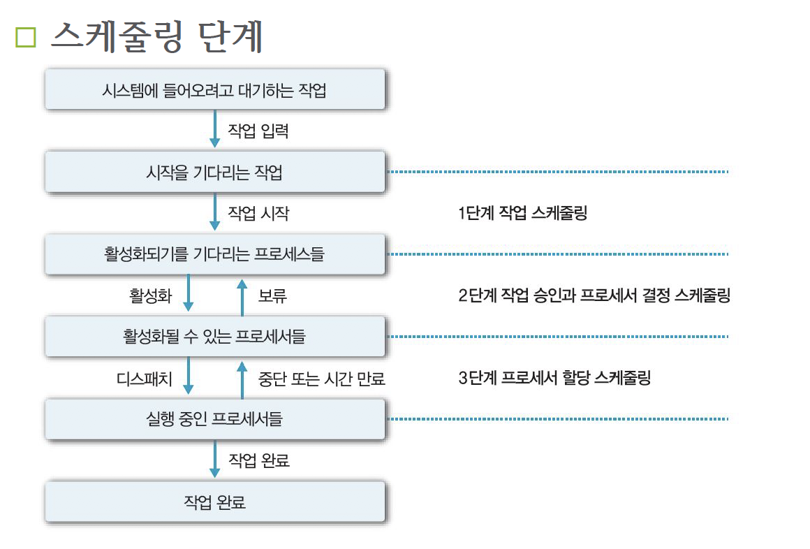

# 1. 스케줄링의 이해

- 스케줄링의 개념
    - 여러 프로세스가 번갈아 사용하는 자원을 어떤 시점에 어떤 프로세스에 할당할지 결정
    - 자원이 프로세서인 경우를 프로세서 스케줄링, 대부분의 스케줄링이 프로세서 스케줄링을 의미
    - 스케줄링 방법에 따라 프로세서를 할당 받을 프로세스를 결정하므로 스케줄링이 시스템의 성능에 영향 미침
    - 좋은 스케줄링은 프로세스 효율성을 높이고, 작업(프로세스)의 응답시간 최소화 하여 시스탬의 작업처리 능력 향상
    - 스케줄링이 필요 없는 프로새스(인터럽트 처리, 오류 처리, 사용자의 시스템 호출 등)의 사전처리가 대표적
    - 반면에 스케줄링이 필요한 프로세스에는 사용자 프로세스와 시스템 호출로 발생하는 시스템 프로세스가 있음

# 2. 스케줄링의 목적
- 스케줄링의 목적
    - 자원 할당의 공정성 보장
    - 단위시간당 처리량 최대화
    - 적절한 반환시간 보장
    - 예측 가능성 보장
    - 오버헤드 최소화
    - 자원 사용의 균형 유지
    - 반환시간과 자원의 활용 간에 균형 유지
    - 실행 대기 방지
    - 사비스 사용 기회 확대
    - 서비스 수 감소 방지

# 3. 스케줄링의 기준 요소

* 버스트(burst) : 어떤 기준에 따라 한 단위로 취급되는 연속된 신호 혹은 데이터의 set, 어떤 현상이 짧은 시간 안에 집중적으로 일어남, 주기억 장치의 블록을 캐시에 적재하는 것

- 프로세스의 실행


*실행(프로세서 버스트)과 입출력 대기(입출력 버스트)의 순환*

# 4. 스케줄링의 단계
- 스케줄링 수행 단계
    1. 작업 스케줄링 : 작업 선택
        - 실제로 시스템 자원을 사용할 작업 결정하는 작업 스케줄링, 승인 스케줄링이라고도 함
        - 작업 스케줄링에 따라 작업 프로세스들로 나눠 생성, 수행 빈도가 적어 장기 스케줄링에 해당
    2. 작업 승인과 프로세서 결정 스케쥴링: 사용 권한 부여
        - 프로세서 사용 권한 부여할 프로세스 결정하는 작업 승인과 프로세서 할당 스케줄링
        - 시스템의 오버헤드에 따라 연기할 프로세스 잠정적으로 결정. 1단계 작업 스케줄링과 3단계 프로세서 할당 스케줄링의 완충 역할, 수행 빈도를 기준으로 하면 중기 스케줄링에 해당, 메모리 사용성도 높이고 작업 효율성 향상시키는 스와핑 기능의 일부로 이해 가능
    3. 프로세서 할당 스케줄링 : 준비상태의 프로세스에 프로세서 할당(디스패칭)
        - 디스패처(분배기)가 준비 상태에 있는 프로세스 중에서 프로세서 할당할 프로세스 결정하는 프로세스 할당 스케줄링, 단기 스케줄링에 해당



* 실제 스케쥴러 코드 . 
https://github.com/torvalds/linux/blob/master/kernel/sched/core.c

```C
/*
 * __schedule() is the main scheduler function.
 *
 * The main means of driving the scheduler and thus entering this function are:
 *
 *   1. Explicit blocking: mutex, semaphore, waitqueue, etc.
 *
 *   2. TIF_NEED_RESCHED flag is checked on interrupt and userspace return
 *      paths. For example, see arch/x86/entry_64.S.
 *
 *      To drive preemption between tasks, the scheduler sets the flag in timer
 *      interrupt handler scheduler_tick().
 *
 *   3. Wakeups don't really cause entry into schedule(). They add a
 *      task to the run-queue and that's it.
 *
 *      Now, if the new task added to the run-queue preempts the current
 *      task, then the wakeup sets TIF_NEED_RESCHED and schedule() gets
 *      called on the nearest possible occasion:
 *
 *       - If the kernel is preemptible (CONFIG_PREEMPTION=y):
 *
 *         - in syscall or exception context, at the next outmost
 *           preempt_enable(). (this might be as soon as the wake_up()'s
 *           spin_unlock()!)
 *
 *         - in IRQ context, return from interrupt-handler to
 *           preemptible context
 *
 *       - If the kernel is not preemptible (CONFIG_PREEMPTION is not set)
 *         then at the next:
 *
 *          - cond_resched() call
 *          - explicit schedule() call
 *          - return from syscall or exception to user-space
 *          - return from interrupt-handler to user-space
 *
 * WARNING: must be called with preemption disabled!
 */
static void __sched notrace __schedule(bool preempt)
{
	struct task_struct *prev, *next;
	unsigned long *switch_count;
	unsigned long prev_state;
	struct rq_flags rf;
	struct rq *rq;
	int cpu;

	cpu = smp_processor_id();
	rq = cpu_rq(cpu);
	prev = rq->curr;

	schedule_debug(prev, preempt);

	if (sched_feat(HRTICK))
		hrtick_clear(rq);

	local_irq_disable();
	rcu_note_context_switch(preempt);

	/*
	 * Make sure that signal_pending_state()->signal_pending() below
	 * can't be reordered with __set_current_state(TASK_INTERRUPTIBLE)
	 * done by the caller to avoid the race with signal_wake_up():
	 *
	 * __set_current_state(@state)		signal_wake_up()
	 * schedule()				  set_tsk_thread_flag(p, TIF_SIGPENDING)
	 *					  wake_up_state(p, state)
	 *   LOCK rq->lock			    LOCK p->pi_state
	 *   smp_mb__after_spinlock()		    smp_mb__after_spinlock()
	 *     if (signal_pending_state())	    if (p->state & @state)
	 *
	 * Also, the membarrier system call requires a full memory barrier
	 * after coming from user-space, before storing to rq->curr.
	 */
	rq_lock(rq, &rf);
	smp_mb__after_spinlock();

	/* Promote REQ to ACT */
	rq->clock_update_flags <<= 1;
	update_rq_clock(rq);

	switch_count = &prev->nivcsw;

	/*
	 * We must load prev->state once (task_struct::state is volatile), such
	 * that:
	 *
	 *  - we form a control dependency vs deactivate_task() below.
	 *  - ptrace_{,un}freeze_traced() can change ->state underneath us.
	 */
	prev_state = prev->state;
	if (!preempt && prev_state) {
		if (signal_pending_state(prev_state, prev)) {
			prev->state = TASK_RUNNING;
		} else {
			prev->sched_contributes_to_load =
				(prev_state & TASK_UNINTERRUPTIBLE) &&
				!(prev_state & TASK_NOLOAD) &&
				!(prev->flags & PF_FROZEN);

			if (prev->sched_contributes_to_load)
				rq->nr_uninterruptible++;

			/*
			 * __schedule()			ttwu()
			 *   prev_state = prev->state;    if (p->on_rq && ...)
			 *   if (prev_state)		    goto out;
			 *     p->on_rq = 0;		  smp_acquire__after_ctrl_dep();
			 *				  p->state = TASK_WAKING
			 *
			 * Where __schedule() and ttwu() have matching control dependencies.
			 *
			 * After this, schedule() must not care about p->state any more.
			 */
			deactivate_task(rq, prev, DEQUEUE_SLEEP | DEQUEUE_NOCLOCK);

			if (prev->in_iowait) {
				atomic_inc(&rq->nr_iowait);
				delayacct_blkio_start();
			}
		}
		switch_count = &prev->nvcsw;
	}

	next = pick_next_task(rq, prev, &rf);
	clear_tsk_need_resched(prev);
	clear_preempt_need_resched();

	if (likely(prev != next)) {
		rq->nr_switches++;
		/*
		 * RCU users of rcu_dereference(rq->curr) may not see
		 * changes to task_struct made by pick_next_task().
		 */
		RCU_INIT_POINTER(rq->curr, next);
		/*
		 * The membarrier system call requires each architecture
		 * to have a full memory barrier after updating
		 * rq->curr, before returning to user-space.
		 *
		 * Here are the schemes providing that barrier on the
		 * various architectures:
		 * - mm ? switch_mm() : mmdrop() for x86, s390, sparc, PowerPC.
		 *   switch_mm() rely on membarrier_arch_switch_mm() on PowerPC.
		 * - finish_lock_switch() for weakly-ordered
		 *   architectures where spin_unlock is a full barrier,
		 * - switch_to() for arm64 (weakly-ordered, spin_unlock
		 *   is a RELEASE barrier),
		 */
		++*switch_count;

		psi_sched_switch(prev, next, !task_on_rq_queued(prev));

		trace_sched_switch(preempt, prev, next);

		/* Also unlocks the rq: */
		rq = context_switch(rq, prev, next, &rf);
	} else {
		rq->clock_update_flags &= ~(RQCF_ACT_SKIP|RQCF_REQ_SKIP);
		rq_unlock_irq(rq, &rf);
	}

	balance_callback(rq);
}
```

* 위는 `__schedule` 코드다..... 분석가능?


*스케줄링 클랴스 구조 (커널 2.6.23 버전)

```C
struct sched_class { /* Defined in 2.6.23:/usr/include/linux/sched.h */
  struct sched_class *next;
  void (*enqueue_task) (struct rq *rq, struct task_struct *p, int wakeup);
  void (*dequeue_task) (struct rq *rq, struct task_struct *p, int sleep);
  void (*yield_task) (struct rq *rq, struct task_struct *p);
  void (*check_preempt_curr) (struct rq *rq, struct task_struct *p);
  struct task_struct * (*pick_next_task) (struct rq *rq);
  void (*put_prev_task) (struct rq *rq, struct task_struct *p);
  unsigned long (*load_balance) (struct rq *this_rq, int this_cpu,
                 struct rq *busiest,
                 unsigned long max_nr_move, unsigned long max_load_move,
                 struct sched_domain *sd, enum cpu_idle_type idle,
                 int *all_pinned, int *this_best_prio);
  void (*set_curr_task) (struct rq *rq);
  void (*task_tick) (struct rq *rq, struct task_struct *p);
  void (*task_new) (struct rq *rq, struct task_struct *p);
};

```

- 위 구조체에서 중요한 함수들
    1. `enqueue_task()` : 태스크가 실행가능한 상태로 진입할 때 호출됩니다.
    2. `dequeue_task()` : 태스크가 더 이상 실행 가능한 상태가 아닐 때 호출됩니다. 
    3. `yield_task()`: 태스크가 스스로 yiedl() 시스템콜을 실행했을 때 호춣됩니다.
    4. `check_preempt_curr()`: 현재 실행중인 태스크를 선점(preempt)할 수  있는지 검사합니다.
    5. `pick_next_task()`: 실행할 다음 태스크를 선택합니다.
    6. `put_prev_task()`: 실행중인 태스크를 다시 내부 자료구조에 넣을 때 호출됩니다.
    7. `load_balance()`: 코어 스케줄러가 태스크 부하를 분산하고자 할 때 호출됩니다.
    8. `set_curr_task()` : 태스크의 스케줄링 클래스나 태스크 그룹을 바꿀 때 호출됩니다.
    9. `task_tick()`: 타이머 틱 함수가 호출합니다.
    10. `task_new()`: 새 태스크가 생성되었을때 그룹 스케줄링을 위해 호출 됨.


* 스케줄링 클래스 구조는 기본 CFS스케줄러에서 사용하는 내부 자료구조와 밀접하게 연관되어있습니다. 
* 예를 들어 각 CPU별로 유지하면서 콜백 함수의 인자로 넘겨지는 실행 큐(sturct rq)는 CFS 스케줄러를 위해 채택한 레드 블랙 트리자료구조를 사용함.

*스케줄링 단계*


# 5. 스케쥴링 큐


*스케줄링 큐*

등의 정보 필요
* 단기 스케줄러
    - 메모리에 적재된 프로세스 중 프로세서를 할당하여 실행상태과 되도록 결정하는 프로세스 스케줄링을 한다. 이때는 프로세스가 실행하는데 필요한 자원의 요청 만족해야 함


*정기 스케줄러와 단기 스케줄러*

