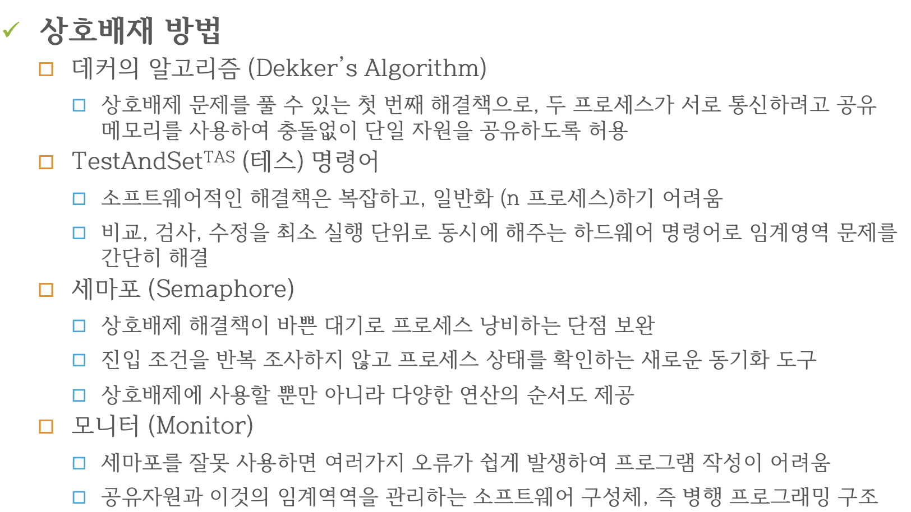

# 식사하는 철학자!!

- 다섯명의 철학자가 식사를 할라구 한다
- 철학자들 사이에는 포크가 하나씩 있다

* 규칙
    - 왼쪽 포크가 사용 가능할때까지 기다린다, 사용 가능하면 집어든다
    - 오른쪽 포크가 사용 가능할때까지 기다린다, 사용 가능하면 집어든다
    - 양쪽 포크 들었으면 식사한다
    - 오른쪽 포크를 내린다
    - 왼쪽 포크를 내린다
    - 다시 첫번째로

* 만약에 모든 철학자가 동시에 왼쪽 포크를 들어버리면 데드락 발생

## 구현한 파이썬 코드

```python3

#! /usr/env/python3

#식사하는 철학자 데드락 구현

import sys
import threading
import time

class Fork:

    def __init__(self, number):
        #총 5개의 젓가락, 각자 고유한 넘버 가진다
        self.number = number
        self.user = -1
        self.lock = threading.Condition(threading.Lock()) #공유자원 락
        self.taken = False # 처음에는 모든 젓가락이 내려감
    
    def take(self, user):
        with self.lock:
            while self.taken == True:
                self.lock.wait() #들고있을때 자원 잠궈놓음(다른 스레드에서 접근 불가)
            self.user = user
            self.taken = True # 젓가락 든상태 
            print("{} took {} fork".format(user, self.number))
            self.lock.notifyAll() #모든 스레드에 자원 점유했다고 인지

    def drop(self, user):
        with self.lock:
            while self.taken == False:
                self.lock.wait()
            self.user = -1
            self.taken = False
            print("{} dropped {} fork".format(user, self.number))
            self.lock.notifyAll()

class Philosopher(threading.Thread): #철학자 객체 -> 스레드

    def __init__(self, number, left, right):
        threading.Thread.__init__(self) #각 철학자는 하나의 스레드다 
        self.number = number #철학자 고유 id 
        self.left = left #왼쪽
        self.right = right #오른쪽
    
    def run(self):
        for i in range(20):
            time.sleep(0.1) # 생각하기
            self.left.take(self.number) #왼쪽 젓가락 들기
            time.sleep(0.1)
            self.right.take(self.number) #오른쪽 젓가락 들기
            time.sleep(0.1)
            self.right.drop(self.number) #식사 후 오른쪽 젓가락 내리기
            self.left.drop(self.number) # 식사후 왼쪽 젓가락 내리기
            
        print(" {} phliosopher finished eating ".format(self.number))

if __name__ == "__main__":
    n = 5
    f = [Fork(i) for i in range(5)]

    p = [Philosopher(i, f[i], f[(i+1)%n]) for i in range(5)]

    for i in range(n):
        p[i].start()
    #데드락에 걸려버림 ㅎㅎ  

```

실행해보면, 바로 첫번쨰 턴에 데드락 걸려버림

데드락 발생 요소중 하나라도 해결하면 해결 가능해서 여러 방법이 있다는디...



- 각 포크를 세마포로 표시, 철학자는 포크에 해당하는 세모파에 대한 wait 연산을 수행하고 나서 포크 집음.
- 즉 포크는 해당 세모파에 대한 signal 연산 수행하여 내려놓음

* 교착 상태 발생 해결책
    - 철학자 4명만 테이블에 동시에 앉도록 하거나
    - 철학자가 양쪽 포크를 모두 사용 할 수 있을 때 포크를 집을 수 있게
    - 비대칭 해결법 -> 홀수번 철학자는 왼쪽 포크 집은 후 오른쪽, 짝수번 철학자는 오른쪽 포크 집은 후 왼쪽 포크 집게

    