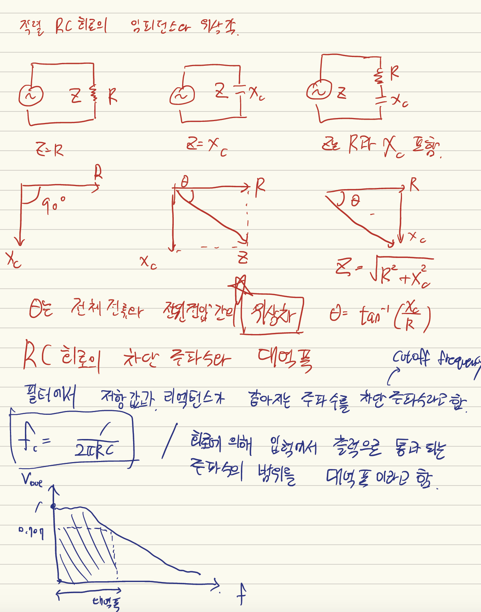
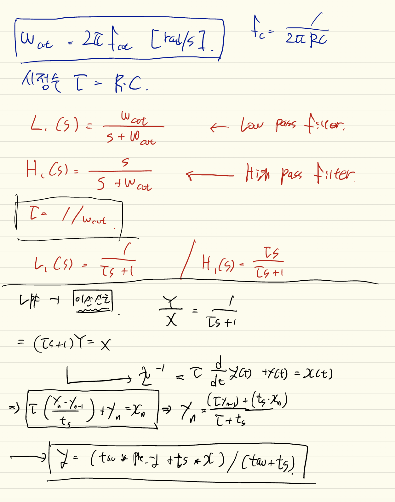

# IoT 디지털 필터 과제

- Low pass filter와 High pass filter 의 원리

* Low pass filter


위 그림은 Low Pass filter를 나타낸 회로도이다.

R + C를 연결하여 Capcitor에서 출력 전압을 뽑아낸다.

HPF의 경우는 위 그림과 저항과 콘덴서가 반대로 연결 되어 있고, 저항에서 출력 전압을 뽑아 내는 회로이다.

여기서 저항은 R, 콘덴서는 Xc라고 하면

Xc = 1/2*pi*f*c 가 나온다.

* 컷 오프 주파수
f_cutoff = 1 / (2 * pi * RC)

LPF의 경우 저항이 큰 쪽이 전압이 많이 걸리는데, 고주파가 걸리면 Xc의 값은 작아진다 (주파수가 역수로 들어가있어서) 따라서 고주파로 갈 수록 출력이 낮아진다.

HPF의 경우 콘덴서에 저주파가 걸릴수록 큰 임피던스가 걸린다. 즉 저주파일수록 출력 전압이 낮아진다.


## LPF, HPF 및 디지털 필터 공부 내용






## 구현한 LPF 및 HPF

- BPF는 공부 해봤지만, 어떻게 구현 해야 할 지 감이 안와서 작성하지 못했습니다 ㅜㅜ

### HPF

```C
#include <stdio.h>

float HighPassFilter(float tau,float ts, float pre_x, float pre_y, float x){
    return tau/(tau + ts) * pre_y + tau / (tau + ts) * (x - pre_x);
}


// HPF를 테스트 해보는 main 문
void main() {
    float tau = 10.0;
    float ts = 1000.0;
    float inputArr[5] = {10.0, 20.0, 30.0 ,5.32, 6.32};
    float result_y[5] = {};
    float tmp = 0;
    for(int i = 0; i<=5; i++){
        if (i == 0){
        result_y[i] = HighPassFilter(tau, ts, 0, 0, inputArr[i]);
        }
        else {
            result_y[i] = HighPassFilter(tau, ts, inputArr[i-1], result_y[i-1], inputArr[i]);
        }
    }

    for(int i = 0; i <=5; i++){
        tmp = result_y[i];
        printf("%f", tmp);
    }
}
```

### LPF

```C
#include <stdio.h>

float LowPassFilter(float tau,float ts, float pre_y, float x){
    return (tau * pre_y + ts * x) / (tau + ts);
    // tau는 시정수
    // ts는 샘플링 타임
    // pre_y는 이전 결과 값
    // x는 현재 input.
}

void main() {
    float tau = 10.0;
    float ts = 1000.0;
    float inputArr[5] = {10.0, 20.0, 30.0 ,5.32, 6.32};
    float result_y[5] = {};
    float tmp = 0;
    for(int i = 0; i<=5; i++){
        if (i == 0){
        result_y[i] =LowPassFilter(tau, ts, 0, inputArr[i]);
        }
        else {
            result_y[i] = LowPassFilter(tau, ts, result_y[i-1], inputArr[i]);
        }
    }

    for(int i = 0; i <=5; i++){
        tmp = result_y[i];
        printf("%f", tmp);
    }
}
```