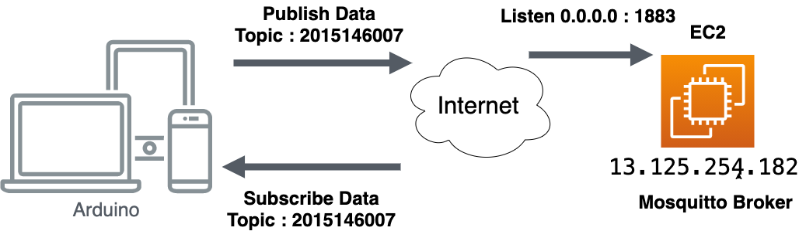
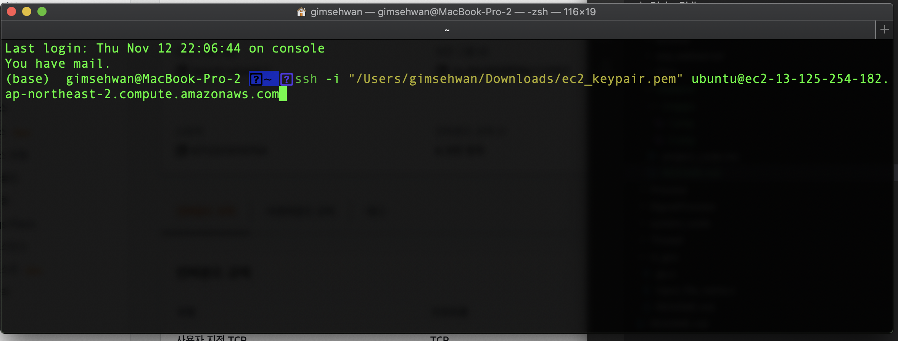
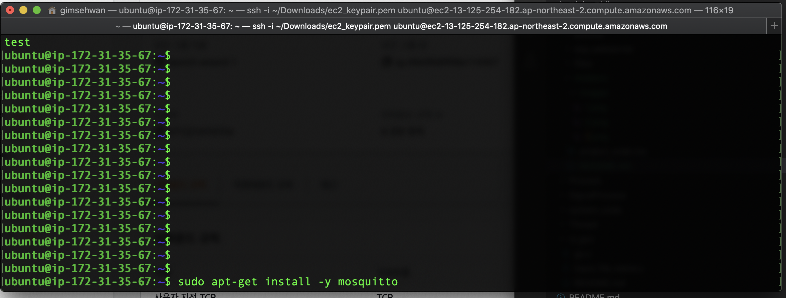

# 2020 가을학기 IoT 기초 중간고사 대체 과제 레포트


- 목차
    - 목표 설정
    - 시스템 구성
    - 제어 알고리즘 블럭도
    - 시스템 구현 코드
    - 감상평

## 목표 설정

1. mqtt broker 서버(mosquitto)를 직접 구현(셋업)한다.
2. arduino를 이옹해 mqtt 프로토콜 기반의 통신을 구현한다. (Subscribe / Publish 구조)
3. 특정 mqtt 메시지를 전달 받았을 때 메인 로직에서 분리하여 이벤트 처리를 하는 콜백 함수를 구현 및 테스트해본다.
4. 조도 센서(ADC 핀)을 활용한 간단한 IoT 기반의 제어를 해본다.


## 시스템 구성



- mqtt broker 서버는 AWS EC2 linux 인스턴스 내부에 설치해서 사용한다.
- 아두이노는 EC2 linux에 설치된 mqtt broker 서버를 통해 subscribe, publish 한다.
- 조도 센서는 ADC핀에 연결하여 사용한다.


## 제어 구성 플로우차트


## 1. Mqtt Broker 셋업.

- AWS의 EC2 Linux (ubuntu) 인스턴스를 사용해서 Public한 환경에서 사용 가능하도록 구축했다.


- AWS의 프리티어 인스턴스 t2.micro를 이용했다.
- 이 Linux 서버의 공인 IP는 13.125.254.182이다.
- OS는 Ubuntu 16.04이다.

* AWS EC2 인스턴스는 보안을 위해 보안 그룹 설정으로 Inbound 요청에 대한 포트 및 soruce ip범위를 지정해 주어야 함.


- <strong>mqtt borker를 설치하기 위한 기본 셋업이 완료 된 상태.</strong>

### EC2 인스턴스에 접속하여 mosquitto 설치하기.



- EC2 인스턴스 생성당시 받은 pem 키를 이용해 원격 접속.



- apt 패키지 매니저를 이용해 mosquitto 설치.

- 1883번 접속 허용을 위해 `ufw disable`로 방화벽을 내림(개발용도)


- `ps -ef | grep mosq`로 mosquitto 서버 프로세스가 올라와있는지 확인한 장면.


- `netstat -tap`를 이용해 현재 서버상에 Listen 하고있는 포트 및 허용된 포트, 소스 IP 범위 확인.

- 현재 1883번으로 `0.0.0.0` 즉 모든 요청에 대해서 Listen 하는 상태다.

## 모듈에서 조도값을 읽고, MQTT Broker로 Publish & Subscribe 후 시리얼 출력  + 조도 값에 따른 제어
## 시스템 구현 코드

```cpp
#include <ESP8266WiFi.h>
#include <PubSubClient.h>

#define LED12 12
#define LED13 13
#define LED14 14
#define DARK 40 //조도센서 값이 20이하일시 매우 어두움
#define LIGHT 90 //조도 센서 값이 90이상일 경우 밝음.
//DARK와 LIGHT 사이는 어두움.

const char* ssid = "iptime"; // for testing opened API
//const char* password  = "";


#define mqtt_server "13.125.254.182" //EC2 인스턴스의 퍼블릭한 ip
#define mqtt_port 1883 //mqtt default port 정의.
#define mqtt_topic "2015146007" //topic은 2015146007 로 설정.
#define mqtt_user "IoT" //user id와 password를 따로 지정하지 않았음 (보안 x -> 개발용)
#define mqtt_password ""


int light = 0; //ADC로부터 받은 값을 저장할 정수형 변수
int lightPinA = 0; //ADC 핀 설정 
char lightData[50]; //mqtt로 Publish 하기 위해서 만든 문자열 배열  

WiFiClient espClient; //WIFI 클라이언트 구조체를 불러온다.
PubSubClient client(espClient);

void setup() {
  WiFi.begin(ssid); //특정 ssid의 와이파이에 커넥션을 맺는다 (ssid만 넣으면 password가 필요 없는 공개 AP에 접속.)
  while (WiFi.status() != WL_CONNECTED) delay(500);

  client.setServer(mqtt_server, mqtt_port);
  client.setCallback(callback); //mqtt msg 수신 했을 경우 수행할 콜백 함수를 정의한다.
  // 콜백 함수란 이벤트 발생시 메인로직이 제어권을 넘겨줄 함수이다.
  
  Serial.begin(9600);
  pinMode(LED12, OUTPUT);
  pinMode(LED13, OUTPUT);
  pinMode(LED14 , OUTPUT);
  pinMode(lightPinA, INPUT);

  digitalWrite(LED12, 0);
  digitalWrite(LED13, 0);
  digitalWrite(LED14, 0);

}

void loop() {
    if (!client.connected()) {
    client.connect("ESP8266Client_12345", mqtt_user, mqtt_password); //clinet id는 다른 유저와 겹치지만 않으면 되기 떄문에 임의로 정의했다.
    client.subscribe(mqtt_topic); //mqtt 특정 topci을 구독중
  }
  sprintf(lightData, "%d", analogRead(lightPinA)); //loop logic에서 analog read한 정수 값 을 lightdata라는 문자열에 저장  
  client.publish(mqtt_topic, lightData); //매 1초마다 publish.
  delay(1000);
  client.loop(); //for looping callback. 콜백을 계속해서 호출하기 위한 loop. -> 한번만 loop 호출되면 될 것 같은데.. 
}


void callback(char* topic, byte* payload, unsigned int length) { //콜백 함수. 이벤트가 발생했을 때 처리하는 부분 
  String Msg = "";
  int i = 0;
  int convertData = 0;
  while (i < length) Msg += (char)payload[i++];
  Serial.println(Msg);
  convertData = Msg.toInt(); //Msg는 문자열이므로, 정수형 데이터로 바꿔서 조건처리 하기 위한 용도. 
  controllLED(convertData); //String을 int로 변환한 값을 controllLED 함수의 인자로 전
  
  //loop 블럭에서 publish한 조도 데이터를 그대로 subscribe해서 터미널에 출력해주는 콜백 함
}

//////////// 컨디션 체크를 해서 특정 핀을 조작하는 리턴이 없는 프로시져(프로세스) //////////////////
void controllLED(int condition) {
  if (condition < DARK) {
    digitalWrite(LED12,0);
    digitalWrite(LED13,1);
    digitalWrite(LED14,1); //LED 1개 점등
  }
  else if ( (condition > DARK) && (condition < LIGHT)){ //20과 90사이 일 경우 2개 점등   
    digitalWrite(LED12,0);
    digitalWrite(LED13,0);
    digitalWrite(LED14,1); //LED 2개 점등
  }

  else { // 그 외 90 이상일 경우 3개 점등 
    digitalWrite(LED12,0);
    digitalWrite(LED13,0);
    digitalWrite(LED14,0); //LED 3개 점등
  }
}
```

## 느낀점

- 실제 실무를 하면서 AWS에서 제공하는 브로커 서버(AWS IOT)만 써보았는데,
- 이번 과제로 직접 mqtt broker를 설치해보면서 좀 더 서버에서의 프로세스를 이해하게 되었다.
- 또한 Linux Server에 셋업 할 때 보안 요소를 신경 쓰는게 중요하다고 느꼈다.
    - 과제용으로 ufw을 disable하고, AWS 보안그룹 또한 모든 소스 ip를 허용하는 등
    - 관대한 정책을 사용했는데, mqtt 특성상 topic 구조를 안다면
    - 매우 쉽게 스니핑 당할 것 같다고 느꼈다.
- 또한 자료를 찾아보면서, 실제로 IoT Device가 mqtt subscribe한 메시지를
- 조건 처리해서 특정한 제어를 실행하는 프로세스가 많다는 것을 느꼈다.

