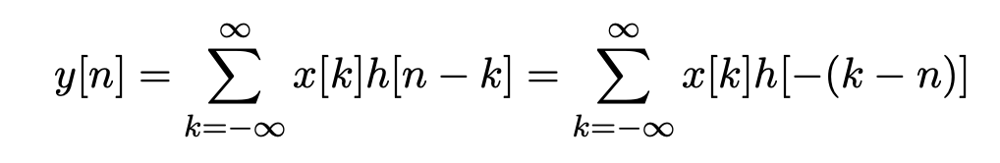
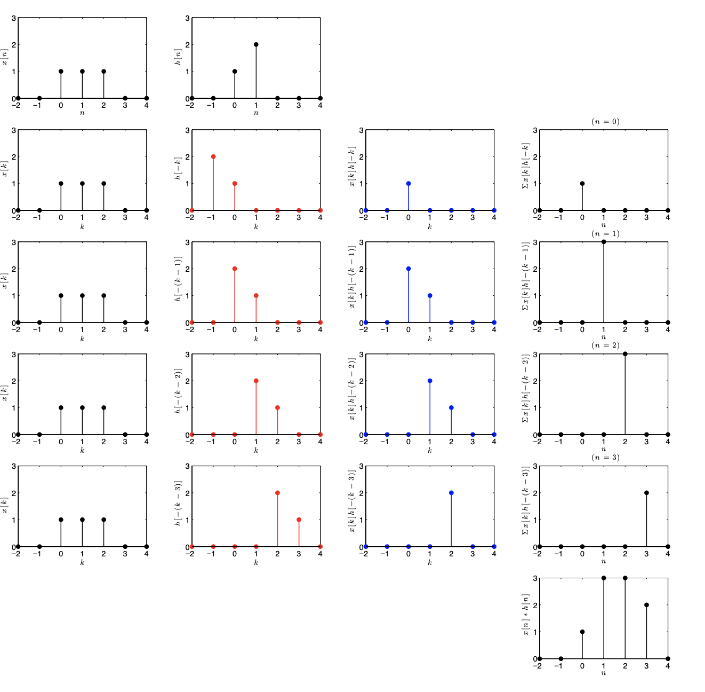
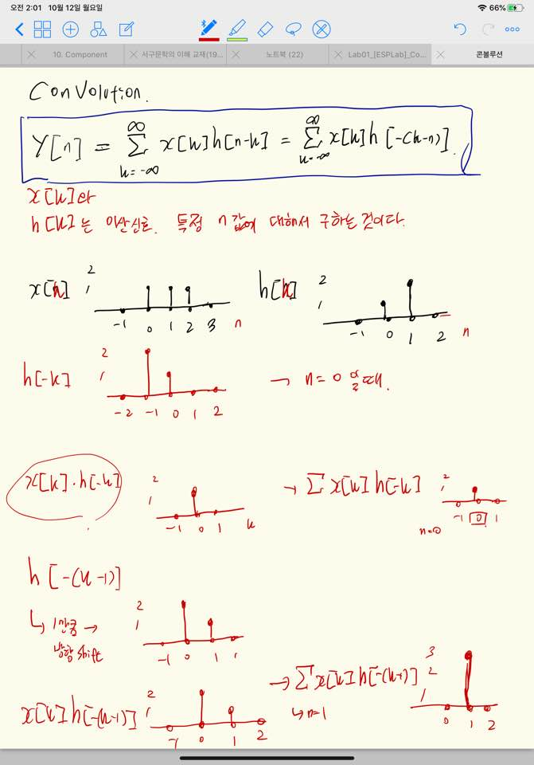

# 컨볼루션 연산

* 컨볼루션 연산은 두 개의 시간 변수 n 과 k를 가지므로 계산 과정에서 시간 변수를 혼돈하여 사용하지 않도록 해야한다.

위 식은 특정 시간 n 값 하나에 대한 컨볼루션 연산 값을 의미한다.

전체 시간 영역에서의 신호를 나타내기 위해 n은 -무한대 ~ 무한대 까지의 값을 가질 수 있다.

일단 기본적으로. 두 신호 x[n] , h[n] 이 주어지면.

한쪽 신호를 뒤집는다 -> h[-n]

그리고 두 신호 모두 시간변수 n을 편의를 위해 k 라는 변수로 바꾼다.

x[k] , h [-k]

여기서 컨볼루션 y[n] (특정 n에 대한) 의 결과 값은

x[k] * h[-(k-n)] 의 모든 k 축에 나타난 신호들의 값을 *합한* 값이다.

이 때 n을 -무한대 ~ 무한대 반복 연산하면 전체 y[n]에 대한 신호처리 값이 나온다.

연산 과정에 대해서 자세히 나와있다.

* 컨볼루션은 교환 법칙이 성립한다.

* 결합 법칙도 성립한다

* 분배 법칙도 성립한다

