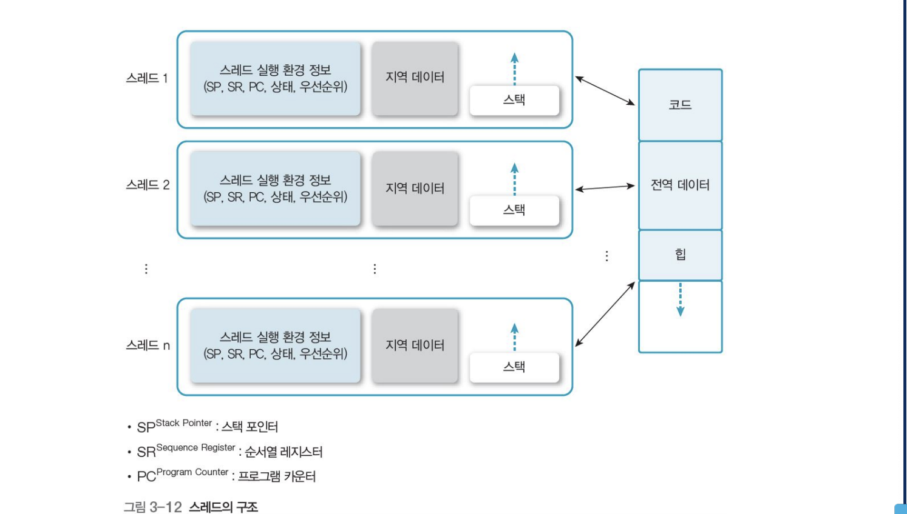
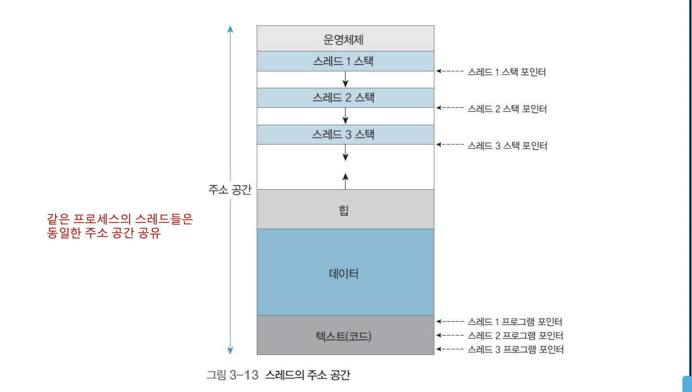

# 스레드의 개념과 상태 변화

- 스레드의 개념
    - 프로세스의 특성인 자원과 제어에서 제어만 분리한 실행 단위
    - 프로세스 하나는 스레드 한 개 이상으로 나눌 수 있음
    - 프로세스의 직접 실행 정보를 제외한 나머지 프로세스 관리 정보 공유
    - 일반적으로 다른 프로시저 호출하고 다른 실행을 기록 (별도 스택 필요)
    - 관련 자원과 함께 메모리 공유 가능하므로 손상된 데이터나 스레드의 이상 동작을 고려해야 함
    - 경량 프로세스 -> 프로세스의 속성 중 일부가 들어가 있는 것
    - 중량 프로세스 -> 스레드 하나에 프로세스 하나인 전통적인 경우
    - 같은 프로세스의 스레드들은 동일한 주소 공간 공유


*스레드의 구조*



*스레드의 주소 공간*




## 스레드의 개념

- 스레드 병렬 수행
    - 프로세스 하나에 포함된 스레드들은 공동의 목적 달성을 위해 병렬 수행
    - 프로세스가 하나인 서로 다른 프로세서에서 프로그램의 다른 부분 동시 실행
- 스레드 병렬 수행의 이점
    - 사용자 응답성 증가
    - 프로세스의 자원과 메모리 공유 가능
    - 경제성 좋음
    - 다중 처리(멀티 프로세싱)로 성능과 효율 향상

## 단일 스레드와 다중(멀티)스레드

- 스레드와 프로세스의 관계
    - 단일 스레드 : 스레드 용어가 탄생하기 전이라 개념 불확
    - 다중 스레드 : 프로그램 하나를 여러 실행단위로 쪼개어 실행한다는 측면에서 다중 처리와 의미 비슷

## 스레드의 상태 변화
- 스레드의 상태 변화
    - 프로세서 함께 사용, 항상 하나만 실행
    - 한 프로세스에 있는 스레드는 순차적 실행, 해당 스레드의 정보 저장레지스터, 스택
    - 프로세스 생성하면 해당 프로세스의 스레드도 함께 생성, 단, 스레드 생성에서는 운영체제가 부모 프로세스와 공유할 자원 초기화 할 필요 없음
    - 프로세스의 생성과 종료보다는 오버헤드 훨씬 적음
    - 스레드 한 개가 대기 상태로 변환 시 전체 프로세스 대기 상태로 변환 않음
    - 실행 상태의 스레드가 대기 상태가 되면 다른 스레드 실행 가능
    - 프로세스 하나에 있는 전체 스레드는 프로세스의 모든 주소에 접근 가능하여 스레드 한 개가 다른 스레드의 스택 읽기나 덮어 쓰기 가능
    - 프로세서는 여러 사용자가 생성하여 서로 경쟁적으로 자원 요구 하고 서로 다른 관계를 유지해야 하지만, 스레드는 사용자 한명이 여러 스레드로 개인 프로세스 하나 소유

## 스레드의 제어 블록
- 스레드 제어 블록
    - 정보 저장
    - 프로세스 제어 블록은 스레드 제어 블록의 리스트
    - 스레드 간에 보호 하지 않음
    - TCB의 내용
        - 실행 상태 : 프로세서 레지스터, 프로그램 카운터, 스택 포인터
        - 스케줄링 정보 : 상태 (실행, 준비, 대기), 우선순위, 프로세서 시간
        - 계정 정보
        - 스케줄링 큐용 다양한 포인터
        - 프로세스 제어 블록 PCB를 포함하는 포인터


## 스레드의 구현
- 스레드의 운영체제에 따른 구현
    - 사용자 수준 스레드 : (n:1) 다대일 매핑
        - 스레드 라이브러리를 이용하여 작동
    - 커널 수준 스레드 : (1:1) 일대일 매핑
        - 커널에서 지원
    - 혼합형 스레드 (n:m) 매핑
        - 사용자 수준 스레드와 커널 수준 스레드를 혼합한 형태

## 사용자 수준 스레드

- 사용자 수준 스레드의 개념
    - 사용자 영역의 스레드 라이브러리로 구현
        - 스레드 라이브러리 : 스레드의 생성과 종료, 스레드 간의 메시지 전달, 스레드의 스케줄링과 문맥 등 정보 보관

```python3

from threading import Thread

def work(id, start, end, result):
    total = 0
    for i in range(start, end):
        total += i
    result.append(total)
    return


if __name__ == "__main__":
    START, END = 0, 100000000
    result = list()
    th1 = Thread(target=work, args=(1, START, END//2, result))
    th2 = Thread(target=work, args=(2, END//2, END, result))
    
    th1.start()
    th2.start()
    th1.join()
    th2.join()

```

상기 코드는 파이썬에서 사용자 수준 Thread를 사용하는 예이다.

우선 2개의 스레드를 사용하고, 데이터를 두 부분으로 나눠서 계산하게 했다.
하나의 스레드를 사용 할 때와 걸린 시간은 비슷했다.

왜냐면 result 라는 전역변수를 서로 공유했고, 파이썬 자체에서 모든 자원의 락(Lock)를 글로벌하게 관리했기 때문이다. 

즉 동일한 변수에 대해서 여러 스레드가 계산하는건 시간 상 이득이 없다.

하지만 그게 아니라면 동시에 여러 작업을 처리 할 수 있기 때문에 (입출력 동작에 관련되었을 때 사용하면 좋겠다.)


```python3
from threading import Thread, active_count, get_ident

def work_1():
    count = 0
    for i in range(100): 
        count += 1
        print("this is thread ! & count here {}".count)
        print("active thread count {}".format(active_count()))
        print("I'am thread 1")

def work_2():
    count = 0
    for i in range(100): #100000 회 반복
        count += 1
        print("this is thread ! & count here {}".count)
        print("active thread count {}".format(active_count()))
        print("I'am thread 2")


if __name__ == "__main__":
    th1 = Thread(target=work_1)
    th2 = Thread(target=work_2)
    
    th1.start()
    th2.start()
    th1.join()
    th2.join()
```

각자 서로 다른 입출력 작업을 하면 시간은 단축 된다 (단일 스레드에서 작업 할 때 보다는)


- 사용자 수준 스레드의 장점
    - 이식성 높음 : 커널에 독립적인 스케줄링을 할 수 있어 모든 운영체제에 적용
    - 오바헤드 적음 : 스케줄링, 동기화를 위해 커널 호출 않으므로, 커널 영역 전환 오버헤드 감소
    - 유연한 스케줄링 가능 : 커널이 아닌 스레드 라이브러리에서 스레드 스케줄링 제어 하므로 응용 프로그램에 맞게 스케줄링 가능

- 사용자 수준 스레드의 단점
    - 시스템의 동시성 지원하지 않음
        - 스레드가 아닌 프로세스 단위로 프로세서 할당하여 다중 처리 환경을 갖춰도 스레드 단위로 다중 처리 불가능 동일한 프로세스의 스레드 한 개 가 대기 상태가 되면 이 중 어떤 스레드도 실행 불가
    - 확장 제약이 따름
        - 커널이 한 프로세스에 속한 여러 스레드에 프로세서를 동시에 할당 할 수 없어 다중 처리 시스템에서 규모 확장 곤란
    - 스레드간 보호 불가능
        - 스레드 간 보호에 커널의 보호 방법 사용 불가 스레드 라이브러리에서 스레드간 보호를 제공해야 프로세스 수준에서 보호 가능


## 커널 수준 스레드
- 커널 수준 스레드의 개념
    - 사용자 수준 스레드의 한계 극복 방법으로, 커널이 스레드와 관련된 모든 작업 관리
    - 한 프로세스에서 다수의 스레드가 프로세서 할당 받아 병행 수행, 스레드 한 개가 대기 상태가 되면 동일한 프로세스에 속한 다른 스레드로 교환 가능
    - 이 때도 커널이 개입하므로 사용자 영역에서 커널 영역으로 전환 필요
    - 커널이 직접 스케줄링하고 실행하기에 사용자 수준 스레드의 커널 자원 부족 문제 해결
    - 커널이 전체 프로세스와 스레드 정보를 유지하여 오버헤드가 커짐
    - 커널이 각 스레드 개별적으로 관리하여 동일한 프로세스의 스레드 병행 수행
    - 스케줄링과 동기화를 하려면 더 많은 자원 필요

## 혼합형 스레드
- 혼합형 스레드의 개념
    - 사용자 수준 스레드와 커널 수준 스레드 혼합한 구조
    - 시스템 호출을 할 때 다른 스레드를 중단하는 사용자 수준 스레드와 커널 수준 스레드 문제 극복 방법
    - 스레드 라이브러리가 최적의 성능 지원하도록 커널이 경량 프로세스 수 동적으로 조절, 사용자 수준 스레드와 커널 수준 스레드가 다대다로 매핑

- 혼합형 스레드의 특징
    - 중량 프로세스와 특징이 동일하면서도 매우 효율적


# 요약 !!!!!!!!!!!!!!!

* 프로세스 개념
    - 운영체제의 주 기능은 프로세스의 생성과 종료
    - 프로세스는 실행 중인 프로그램으로, 실행되는 프로세스는 독립적 혹은 협조적일 수 있음
    - 협조적 프로세스는 논리적 주소 공간을 직접 공유 또는 파일을 통해서 데이터 공유 가능

* 프로세스 상태
    - 프로세스 상태는 프로세스의 현재 활동에 의해 정의되며, 각 프로세스는 생성, 준비, 실행, 대기 , 종료 상태로 구분 실행하면서 상태 변경 !
    - 프로세스 제어 블록에 의해 운영체제에서 표현되며, 프로세스의 일시 정지 상태를 이용하여 다중 프로그래밍 환경에서 프로세스 유휴 시간 발생 해결 가능

* 문맥 교환
    - 프로세스 전환 시, 이전 프로세스 상태 레지스터 내용을 보관, 또 다른 프로세스의 레지스터를 적재하는 문맥 교환 과정을 거침

* 프로세스와 스레드
    - 운영체제는 프로세스를 자원의 소유, 스레드 실행 단위로 개념을 분리
    - 하나의 프로세스를 다수의 실행 단위로 구분하여 자원을 공유, 자원의 생성과 관리의 중복성을 최소화 하여 수행 능력 향상

* 스레드 상태
    - 준비, 실행, 대기, 종료 상태로 구분
    - 한 프로세스에 있는 스레드는 순차적으로 실행, 자신의 정보를 위한 프로그램 카운터와 스택을 각각 가짐

* 사용자 수준 스레드와 커널 수준 스레드
    - 사용자 수준 스레드 : 스레드 사이의 교환에 커널이 개입하지 않아 빠름
    - 커널 수준 스레드 : 같은 프로세스의 스레드를 동시에 스케쥴링 가능

* 혼합형 스렏그
    - 사용자 수준 스레드 생성시, 커널 수준 스레드를 생성
    - 스레드 수가 제한되는 일대일 방식과 어떤 스레드가 시스템 호출 시 다른 스레드가 중단되는 다대일의 문제를 해결하기 위한 방법